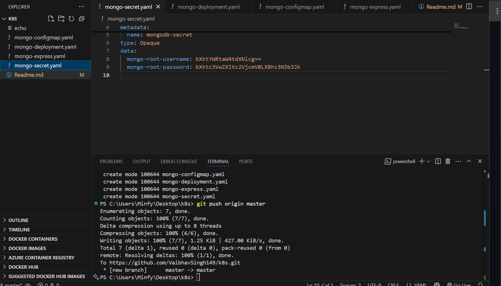

## MongoDB + Mongo-Express on Kubernetes(KUBERNETES - TAKE HOME ASSINGMENT)\

### 🎯 Objective
- Deploy a secure, real-world, multi-tier application on Kubernetes using best practices for secrets and configuration. This project sets up a MongoDB database and a Mongo-Express web interface, all managed by Kubernetes.

### Basic Workflow
- Workflow: User → (LoadBalancer Service) → Mongo-Express Pod → (Internal Service) → MongoDB Pod (with Secrets/ConfigMaps for credentials and configs)

### How to deploy
1. Create and apply kubernetes secret

2. Deploy mongoDB with an internal server
- write a Deployment for MongoDB and a Service to give it a stable internal address.
- Reference the secret for MongoDB credentials in the deployment.

3. Create a ConfigMap for App Config
- Make a ConfigMap for the Mongo-Express app to know the database’s internal service name.
- Apply the ConfigMap

4. Deploying mongo express with an external service
- A Deployment for Mongo-Express, referencing both the ConfigMap and Secret for configuration and credentials.
- Now we will Mongo-Express with a Service of type LoadBalancer (or NodePort for Minikube).

5. Now that we have configured most of it, we will try and access it
- We'll use our cluster’s service management (like minikube service mongo-express-service) to get the external URL.
- Login to Mongo-Express in browser with the credentials we created and check that it connects to MongoDB.

6. I tried creating a user with my own name, to check the working 

7. Cleanup
- Delete all deployments, services, secrets, and configmaps you created for this assignment.

### Error I faced

- I had to delete minikube and try again, after running an update command, then it worked

### My minikube mongo creds 
