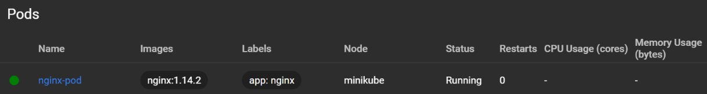
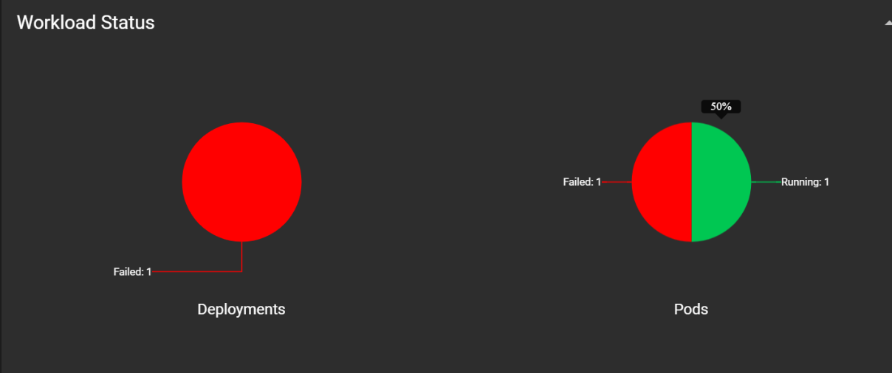
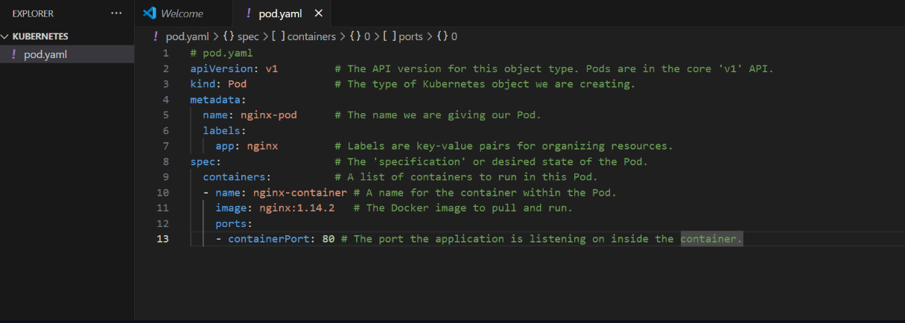

## 📝 Step-by-Step Guide

1. Make the Pod Definition File (pod.yaml)
- Everything in Kubernetes uses a YAML file. Here’s one that tells Kubernetes to run an NGINX server for us.

- Copy this into a new file named pod.yaml:

```bash
apiVersion: v1
kind: Pod
metadata:
  name: nginx-pod
  labels:
    app: nginx
spec:
  containers:
  - name: nginx-container
    image: nginx:1.14.2
    ports:
    - containerPort: 80
``` 
2. Deploy the Pod
- Now we tell Kubernetes to create this pod using the command line.

- Open terminal and run:
```bash
kubectl apply -f pod.yaml
```

- If it works, we should see something like this:
`pod/nginx-pod created`

---
3. Check If the Pod is Running
Let’s make sure our pod is up and running:

```bash
kubectl get pods
```

For more details (like which node it's on):
```bash
kubectl get pods -o wide
```

4. See the Logs
Let’s check the logs to make sure the NGINX server is starting correctly:
```bash
kubectl logs nginx-pod
```

5. Get More Info (For Troubleshooting)
If something doesn’t work, this command gives you a lot of helpful info:
```bash
kubectl describe pod nginx-pod
```

- Now that everything looks fine, the pods will be visible



- This confirms our build is successful

- Pod configuration, `pods.yaml`


---
--- 

## MongoDB + Mongo-Express on Kubernetes(KUBERNETES - TAKE HOME ASSINGMENT)\

### 🎯 Objective
- Deploy a secure, real-world, multi-tier application on Kubernetes using best practices for secrets and configuration. This project sets up a MongoDB database and a Mongo-Express web interface, all managed by Kubernetes.


### Basic Workflow
- Workflow: User → (LoadBalancer Service) → Mongo-Express Pod → (Internal Service) → MongoDB Pod (with Secrets/ConfigMaps for credentials and configs)

### How to deploy
1. Create and apply kubernetes secret


2. Deploy mongoDB with an internal server
- write a Deployment for MongoDB and a Service to give it a stable internal address.
- Reference the secret for MongoDB credentials in the deployment.

3. Create a ConfigMap for App Config
- Make a ConfigMap for the Mongo-Express app to know the database’s internal service name.
- Apply the ConfigMap

4. Deploying mongo express with an external service
- A Deployment for Mongo-Express, referencing both the ConfigMap and Secret for configuration and credentials.
- Now we will Mongo-Express with a Service of type LoadBalancer (or NodePort for Minikube).


5. Now that we have configured most of it, we will try and access it
- We'll use our cluster’s service management (like minikube service mongo-express-service) to get the external URL.
- Login to Mongo-Express in browser with the credentials we created and check that it connects to MongoDB.


6. I tried creating a user with my own name, to check the working 


7. Cleanup
- Delete all deployments, services, secrets, and configmaps you created for this assignment.

### Error I faced


- I had to delete minikube and try again, after running an update command, then it worked


### My minikube mongo creds 
